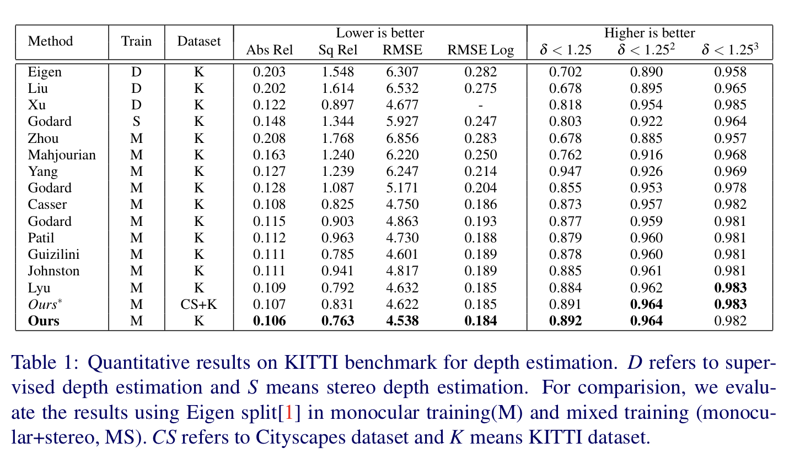
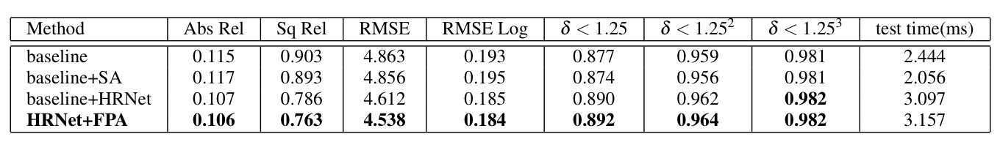

# MDE-2021

The supplementary experimental results of *Self-supervised Depth Estimation Network with High Resolution Features and Non-local Information* will be listed on this page.

## Cityscapes dataset

We download the [Cityscapes](https://www.cityscapes-dataset.com/downloads/) dataset and train our network using cityscapes and KITTI (without pretraining).

*The experiment train from scratch and we will supplement the results of training the network with pre-trained weights in a few days.

## Computation Cost

We test on different networks and list the time for inputting a single image to calculate depth information as follows.

